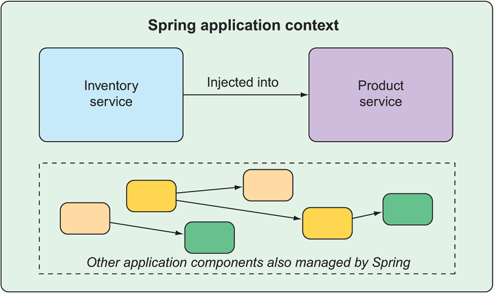

# Simplifying the Spring Framework
This repository is meant to help you understand the fundamentals
of the Spring framework.

## Motivation
With the evolution of Spring over the years, and the advent of Spring Boot
I've noticed developers using the tool, but not understanding
what it does underneath the hood. This resulted in them having
a difficult time when it came to debugging issues.

## Project Organization
This repo is has lessons to illustrate how the Spring framework
works, but you'll have to know in which order to view the files.
The layout is as follows:

### Introduction: The Domain
We're using an example of using software to run 
and manage a hospital. 

See the following interfaces. 
```
Doctor.java
HospitalService.java
```

### Chapter 1: The drawbacks of tightly-coupled systems
See the following classes, and the comments within them.
```
Surgeon.java
TightlyCoupledHospital.java
TightlyCoupledRunner.java
Main.java
```

### Chapter 2: Dependency Injection without frameworks
See the following classes, and the comments within them.
```
Surgeon.java
DependencyInjectedHospital.java
DependencyInjectedHospitalSpec.groovy
DependencyInjectedRunner.java
Main.java
```

### Chapter 3: Using Spring for explicit Dependency Injection
See the following classes, and the comments within them.
```
PrimaryCareProvider.java
SpringConfigHospital.java
ExplicitHospitalConfig.java
SpringConfigHospitalIntegrationSpec.groovy
SpringExplicitConfigRunner.java
Main.java
```

### Chapter 4: Using Spring for implicit Dependency Injection
See the following classes, and the comments within them.
```
Pediatrician.java
SpringComponentHospital.java
ComponentScanHospitalConfig.java
SpringComponentHospitalIntegrationSpec.groovy
SpringImplicitConfigRunner.java
Main.java
```

### Spring Framework Modules


### Spring Application Context


## References
- [Spring in Action, Fourth Edition](https://www.manning.com/books/spring-in-action-fourth-edition)
- [Spring Documentation](https://docs.spring.io/spring-framework/docs/4.0.x/spring-framework-reference/html/overview.html)
- [Spring Application Context](https://www.baeldung.com/spring-application-context)
- [Spring Component Scan Filters](https://www.baeldung.com/spring-componentscan-filter-type)